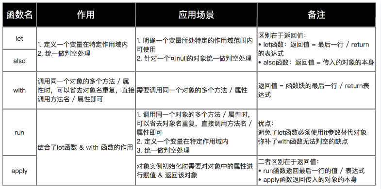

# Kotlin内置的函数

## let函数

### 定义

*一个作用域函数*

### 作用

*定义一个变量在一个特点的作用域范围内避免写一些判断null的操作*

### 应用场景

*明确一个变量所处特点的作用域范围内可使用*

*针对一个可null的对象统一做判空处理*

### 特点

- let函数返回类型，是根据匿名函数最后一行的变化而变化
- let函数的匿名函数里边持有的是it==集合本身

### 使用方法

```kotlin
// 作用1：使用it替代object对象去访问其公有的属性 & 方法
object.let {
    it.todo()
}

// 作用2：判断object为null的操作
object?.let {//表示object不为null的条件下，才会去执行let函数体
    it.todo()
}

// 注：返回值 = 最后一行 / return的表达式
```

### 示例

```kotlin
// 使用Java
if (mVar != null) {
    mVar.function1();
    mVar.function2();
    mVar.function3();
}

// 使用kotlin（无使用let函数）
mVar?.function1()
mVar?.function2()
mVar?.function3()

// 使用kotlin（使用let函数）
// 方便了统一判空的处理 & 确定了mVar变量的作用域
mVar?.let {
    it.function1()
    it.function2()
    it.function3()
}
```

## also函数

## 作用与应用场景

与let函数类似，但区别在于返回值：

- let函数：返回值 = 最后一行 return 的表达式
- also函数：返回值 = 传入的对象的本身

### 特点

- also函数返回类型，用于都是本身
- also函数的匿名函数里边持有的是it==集合本身

### 使用示例

```kotlin
// let函数
var result = mVar.let {
    it.function1()
    it.function2()
    it.function3()
    999
}
// 最终结果 = 返回999给变量result

// also函数
var result = mVar.also {
    it.function1()
    it.function2()
    it.function3()
    999
}
// 最终结果 = 返回一个mVar对象给变量result

```

## with函数

### 作用

调用同一个对象的多个方法或属性时，可以省去对象名重复，
直接调用方法名或属性即可

### 应用场景

需要调用同一个对象的多个方法或属性

### 使用方法

```kotlin
with(object) {
    // ... 
}

// 返回值 = 函数块的最后一行 / return表达式
```

### 使用示例

```kotlin
// 此处要调用people的name 和 age属性
// kotlin
val people = People("carson", 25)
with(people) {
    println("my name is $name, I am $age years old")
}

// Java
User peole = new People("carson", 25);
String var1 = "my name is " + peole.name + ", I am " + peole.age + " years old";
System.out.println(var1);
```

### 特点

- with函数返回类型，是根据匿名函数最后一行的变化而变化
- with函数的匿名函数里边持有的是this==本身

## run函数

### 作用与应用场景

结合了let、with两个函数的作用，即：

- 调用同一个对象的多个方法或属性时，可以省去对象名重复，直接调用方法名或属性即可
- 定义一个变量在特定作用域内
- 统一做判空处理

### 使用方法

```kotlin
object.run {
// ... 
}
// 返回值 = 函数块的最后一行 / return表达式
```

### 使用示例

```kotlin
// 此处要调用people的name 和 age属性，且要判空
// kotlin
val people = People("carson", 25)
people?.run {
    println("my name is $name, I am $age years old")
}

// Java
User peole = new People("carson", 25);
if (people != null) {
    String var1 = "my name is "+peole.name+", I am "+peole.age+" years old";
    System.out.println(var1);
}

```

### 特点

- run函数返回类型，是根据匿名函数最后一行的变化而变化
- run函数的匿名函数里边持有的是this==本身

## apply函数

### 作用与应用场景

与run函数类似，但区别在于返回值：

- run函数返回最后一行的值 / 表达式
- apply函数返回传入的对象的本身

### 应用场景

对象实例初始化时需要对对象中的属性进行赋值和返回该对象

### 使用方法

```kotlin
object.apply {
// ... 
}
// 返回值 =  调用对象object

```

### 使用示例

```kotlin
// run函数
val people = People("carson", 25)
val result = people?.apply {
    println("my name is $name, I am $age years old")
}
// 最终结果 = 返回people给变量result

// Java
val people = People("carson", 25)
if (people != null) {
    System.out.println("my name is $name, I am $age years old");
    return this;
}
// 最终结果 = 返回一个people对象给变量result

```

### 特点

- apply函数返回类型，用于都是本身
- apply函数的匿名函数里边持有的是this==本身

## 总结


